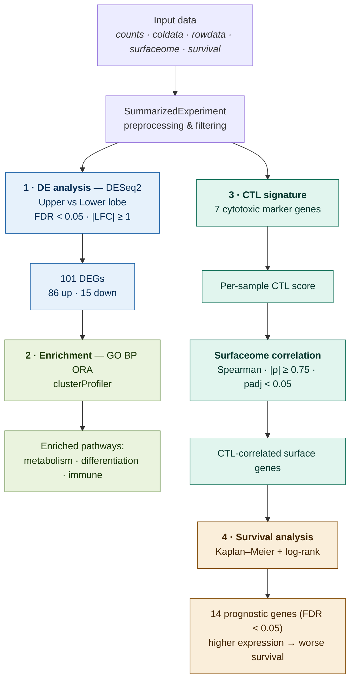

# Lung Squamous Cell Carcinoma (LUSC) — Upper vs. Lower Lobe Transcriptomic Project

A bulk RNA-seq analysis pipeline written in R (R Markdown) exploring the molecular differences between **Lung Squamous Cell Carcinoma (LUSC)** tumors arising in the **upper** versus the **lower lung lobe**, followed by an immune-focused investigation linking a cytotoxic T lymphocyte (CTL) signature to the cell-surface transcriptome (surfaceome) and to patient survival.

## Biological background and rationale

LUSC is a subtype of non-small cell lung cancer (NSCLC) accounting for roughly 20–30% of lung cancer cases. It originates from the epithelial cells lining the bronchial airways, is strongly associated with tobacco smoking, and is characterized by keratinization and frequent genomic alterations in genes governing the cell cycle and oxidative stress responses.

Because upper and lower lobes belong to the same organ and share the same cell types and physiological functions, large transcriptional differences are not expected a priori. The working hypothesis is therefore that any differences are likely to be subtle and to reflect the tumor microenvironment (immune infiltration, inflammatory signaling, oxidative stress, hypoxia/vascularization) and regional epithelial programs, rather than intrinsic tumor-cell biology — and that they may be more visible at the level of pathway enrichment than as large sets of differentially expressed genes. The broader aim is to assess whether these expression profiles differ enough to inform personalized therapeutic strategies.

## Data

The analysis is built on TCGA-style LUSC data, provided as separate files and assembled into a `SummarizedExperiment`:

- `LungSquamousCarcinoma_counts.csv` — raw gene-level count matrix
- `LungSquamousCarcinoma_coldata.csv` — sample (clinical) metadata
- `LungSquamousCarcinoma_rowdata.csv` — gene annotation
- `SurfaceomeTable.xlsx` — reference list of cell-surface genes (the surfaceome)
- `SurvivalDataLUSC.csv` — overall survival times and events

## Pipeline overview

The project is organized into four blocks, each producing saved tables (under `results/`) and figures (under `plots/`). After a shared preprocessing step, the analysis splits into two arms: an anatomical comparison (DE → enrichment) and an immune-focused investigation (CTL signature → surfaceome correlation → survival).



### 1. Differential expression (DE) analysis

The DE analysis was performed with **DESeq2**, comparing tumors by anatomical origin (`tissue_or_organ_of_origin.diagnoses`, upper vs. lower lobe).

Key steps:

- **Preprocessing / biological filtering** — removal of normal solid tissue and of ambiguous or non-relevant origins (e.g., "Lung, NOS", "Main bronchus", "Middle lobe", "Overlapping lesion"); cleaning and factorization of the grouping variable; conversion of the count matrix to integer storage; and renaming of reserved metadata columns.
- **Low-count filtering** — genes were retained only if they had at least 10 counts in a number of samples equal to or greater than the smallest group of the design variable.
- **Model fitting and contrast** — the upper-vs-lower contrast was evaluated at **FDR < 0.05** with an effect-size cutoff of **|log2 fold change| ≥ 1**.
- **LFC shrinkage** — fold-change estimates were stabilized with the **apeglm** method. For ~75% of genes shrinkage altered the LFC by less than 0.1, indicating a well-powered dataset; shrunken estimates were used for ranking and visualization.
- **Annotation** — gene symbols were mapped to Entrez and Ensembl identifiers via `org.Hs.eg.db`.

**Result:** out of an initial ~56,786 genes, **101 differentially expressed genes** were identified (**86 up-regulated** and **15 down-regulated** in the upper lobe relative to the lower lobe). Given the large sample size (433 tumors), the tests are highly powered and capture even small biological differences. Visual diagnostics include a p-value histogram, raw vs. shrunken MA plots, a labeled volcano plot, and per-gene normalized-count boxplots for the top 10 genes.

### 2. Functional enrichment (GO over-representation analysis)

The 101 DEGs were submitted to a **GO Biological Process over-representation analysis (ORA)** with **clusterProfiler**, using the full set of analyzable (post-filter) genes as the statistical background. Of the 101 DEGs, 99 mapped unambiguously to Entrez IDs; redundant GO terms were collapsed with `simplify()`. Results are visualized as dot plots, bar plots, and a gene-concept network (cnetplot).

The top enriched processes — *response to alcohol*, *intermediate filament organization*, *tyrosine metabolic process*, and *cell recognition* — point to three broad differences between upper- and lower-lobe LUSC: **metabolic rewiring** (stronger amino-acid metabolism and xenobiotic/oxidative-stress responses in upper-lobe tumors), **reduced epithelial differentiation** (down-regulation of keratin programs in the upper lobe, often linked to greater plasticity and invasiveness), and **immune / stress-response differences** — plausibly tied to regional variation in airflow and smoke deposition across the lobes.

### 3. CTL signature & surfaceome correlation

This block shifts from anatomical comparison to immune biology, asking which **cell-surface genes** track with cytotoxic T lymphocyte activity across the LUSC cohort.

- A **CTL signature** was defined from canonical cytotoxic markers (`GZMA`, `GZMB`, `GZMH`, `GZMK`, `CD8A`, `NKG7`, `PRF1`). Counts were normalized and variance-stabilized (VST) for exploratory analysis. As expected, the signature genes are strongly positively correlated with one another (Spearman heatmap), and a per-sample **CTL score** was computed as their mean expression.
- The **surfaceome** gene list was read from the reference table and intersected with the expressed genes in the dataset.
- Each surfaceome gene was tested for **Spearman correlation** against the CTL score, with **Benjamini–Hochberg** correction. Genes were called significant at **|ρ| ≥ 0.75** and **adjusted p < 0.05**, and the top 20 were highlighted.

The most strongly correlated surface genes are textbook markers of cytotoxic T-cell identity and function — TCR/CD3 components (`CD3D`, `CD3G`, `CD2`, `CD7`, `CD8A`), the cytotoxic effector `FASLG`, chemokine receptors driving T-cell trafficking and tissue retention (`CXCR3`, `CXCR6`, `CCR5`), co-stimulatory/adaptor molecules (`TRAT1`, `ICOS`), and co-inhibitory receptors (`CD96`, `CD244`). The simultaneous presence of activating and inhibitory receptors is the molecular hallmark of a dysfunctional/exhausted CTL phenotype and of adaptive immune resistance. Two poorly characterized lymphocyte-restricted orphan GPCRs (`GPR171`, `P2RY10`) also rank near the top, flagging them as candidate novel surface biomarkers. Together, these very high, biologically coherent correlations validate the CTL signature and show that the LUSC surfaceome is substantially shaped by the degree and quality of cytotoxic infiltration.

### 4. Survival analysis (in combination with the CTL signature)

The CTL-correlated surface genes from the previous step were then tested as **prognostic biomarkers**, directly linking the immune signature work to clinical outcome. Of 552 tumors with expression data, 544 had matched overall-survival information.

For each gene, samples were split into high- and low-expression groups using an **optimal cut-point** (maximizing the log-rank statistic via `surv_cutpoint`), and **Kaplan–Meier** curves were compared with the **log-rank test**, followed by **BH multiple-testing correction**.

**Result:** **14 genes** were significant at **FDR < 0.05** (including `CD3D`, `FASLG`, `HLA-DRA`, `HLA-DMB`, `PTPRC`, `TRAT1`, `ICOS`, `SLAMF6`, `CD226`, `CCR5`, `FCRL6`, `TNFSF13B`, `GPR171`, `P2RY10`), expanding to **28 genes** at **FDR < 0.10**. Crucially, across **every** Kaplan–Meier curve, **higher expression was associated with worse overall survival**.

This is paradoxical at face value, since a stronger cytotoxic infiltrate usually predicts better prognosis. Three (non-mutually-exclusive) explanations are discussed: (i) immune infiltration as a marker of more aggressive, neoantigen-rich tumors that still progress; (ii) **T-cell exhaustion**, supported by co-expression of activation markers and inhibitory receptors (`CD244`, `CD96`, and borderline `PDCD1`/PD-1); and (iii) an **immunosuppressive microenvironment**, where `ICOS`⁺ regulatory T cells, MDSCs, or tumor-associated macrophages suppress otherwise-present cytotoxic cells. In all three, immune infiltration and effective immune control are dissociated.

## Conclusions

The genes most strongly associated with poor overall survival are dominated by immune-cell infiltration and cytotoxic lymphocyte function (TCR signaling, NK/T-cell cytotoxicity, leukocyte recruitment, antigen presentation). High expression marking *worse* outcome suggests the infiltrate is ineffective or dysfunctional, or accompanies an intrinsically more aggressive tumor. The study is intended as an initial, exploratory characterization rather than a definitive biological dissection, and is meant to seed more detailed follow-up investigations.

## Repository structure (generated at runtime)

```
LUSC_final_project.Rmd      # main analysis notebook
plots/
├── DE_analysis/            # p-value histogram, MA, volcano, per-gene boxplots
├── enrichment/             # GO dot/bar/cnet plots
├── ctl/                    # CTL heatmap, surfaceome correlation scatter/labels
└── survival/               # Kaplan–Meier curves, p-value distribution
results/
├── mapping/                # symbol→Entrez mapping tables
├── enrichment/             # GO BP (raw + simplified)
├── ctl/                    # CTL–surfaceome correlations, significant genes, top 20
└── survival/               # log-rank results, significant genes (FDR 0.05 / 0.10)
```

## How to run

1. Place the input files (`*_counts.csv`, `*_coldata.csv`, `*_rowdata.csv`, `SurfaceomeTable.xlsx`, `SurvivalDataLUSC.csv`) in the working directory.
2. Open `LUSC_final_project.Rmd` in RStudio and knit, or run the chunks sequentially.
3. The first chunk installs and loads the required CRAN packages (`ggplot2`, `pheatmap`, `readxl`, `ggrepel`, `survival`, `survminer`) and Bioconductor packages (`SummarizedExperiment`, `DESeq2`, `org.Hs.eg.db`, `clusterProfiler`, `apeglm`). Output folders are created automatically.

---

## Disclaimer

This README description was written with the assistance of AI (Claude). The content was reviewed and checked against the original analysis and results in `LUSC_final_project.Rmd` by the author to ensure it accurately reflects the work that was actually performed.
